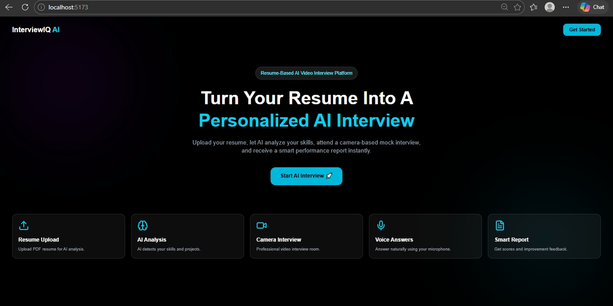
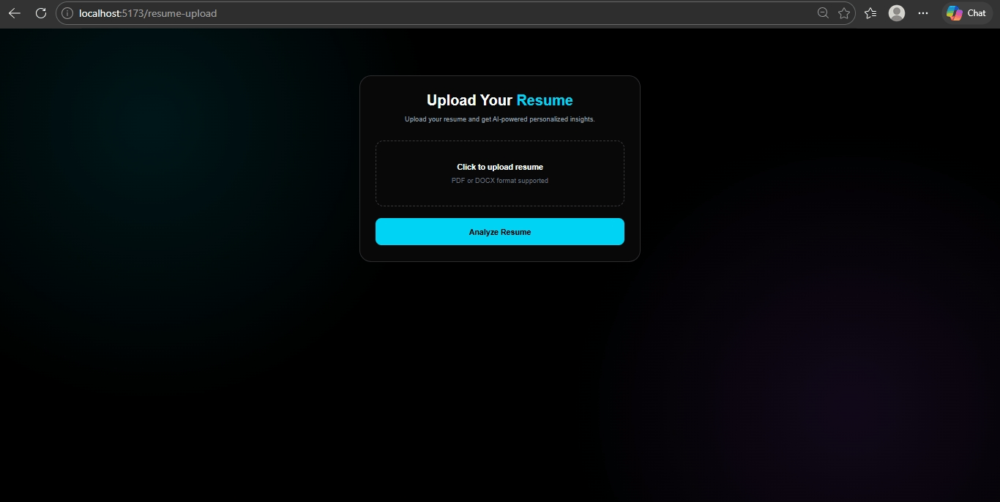
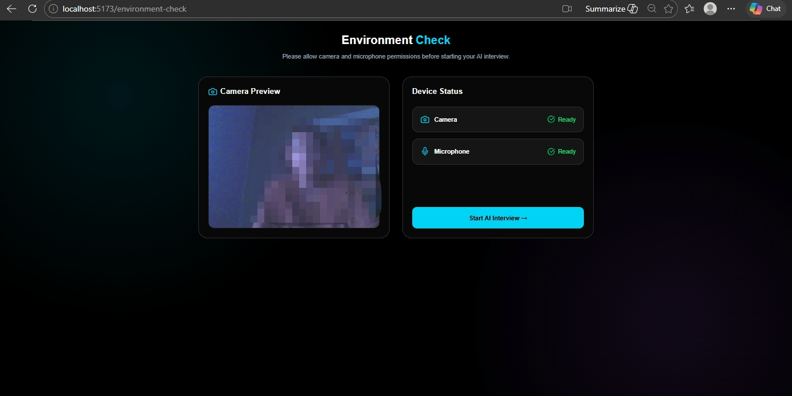
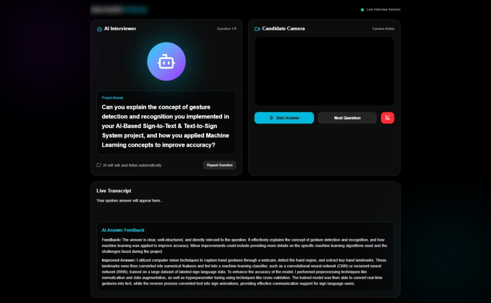
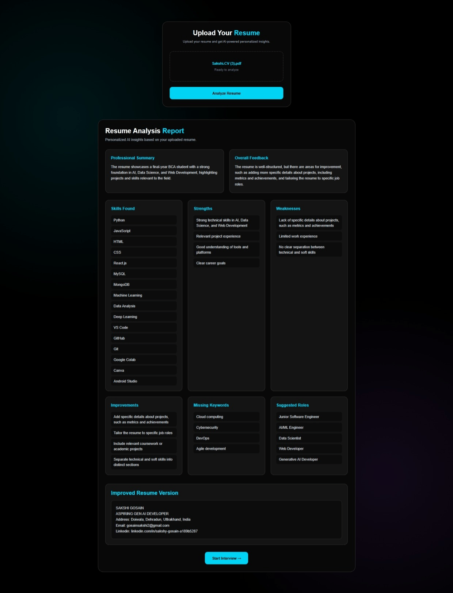

# InterviewIQ AI 🎯

AI-powered mock interview platform that helps candidates practice interviews, receive intelligent feedback, and improve their communication and technical skills.

## Features

* Dynamic AI-generated interview questions
* AI-powered answer evaluation using Groq
* Resume-based interview customization
* Webcam integration
* PDF report generation
* Responsive user interface

## Tech Stack

### Frontend

* React.js
* JavaScript
* CSS

### Backend

* Node.js
* Express.js

### AI

* Groq API (LLaMA Models)

## Installation

```bash
git clone https://github.com/gosainsakshi2-creator/interviewiq-ai.git
cd interviewiq-ai
```

### Frontend

```bash
cd client
npm install
npm run dev
```

### Backend

```bash
cd server
npm install
npm start
```

### Environment Variables

Create a `.env` file inside the server folder:

```env
GROQ_API_KEY=your_api_key_here
```

## Future Improvements

* Voice-based interview evaluation
* Multi-language support
* Interview analytics dashboard
* Performance tracking

##Screenshots
## 📸 Landing Page



## 📄 Resume Upload



## 🎥 Environment Check



## 🤖 Interview Room



## 📊 Performance Report



## Developer

**Sakshi Gosain**

Final Year BCA (AI & Data Science) Student
Aspiring GenAI Developer | Software Engineer | AI Enthusiast
